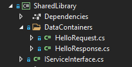

# CommsNet - Network abstraction library

Net Standard 2.0 communication framework. WCF replacement. Uses MessagePack for serialization.

**Table of Contents**
- [CommsNet - Network abstraction library](#commsnet---network-abstraction-library)
  - [1. Overview](#1-overview)
  - [2. Installation](#2-installation)
  - [3. CommsNet architecture](#3-commsnet-architecture)
    - [A. DuplexConnection](#a-duplexconnection)
      - [I. Creating DuplexConnection](#i-creating-duplexconnection)
      - [II. Sending data](#ii-sending-data)
      - [III. Receiving data](#iii-receiving-data)
      - [IV. Error handling](#iv-error-handling)
      - [V. Log](#v-log)
      - [VI. Stopping transmission](#vi-stopping-transmission)
    - [B. ConnectionManager](#b-connectionmanager)
      - [I. Creating ConnectionManager](#i-creating-connectionmanager)
      - [II. Client and server](#ii-client-and-server)
      - [III. New sessions](#iii-new-sessions)
      - [IV. Accessing session](#iv-accessing-session)
      - [V. Sending data](#v-sending-data)
      - [VI. Receiving data](#vi-receiving-data)
      - [VII. Error handling](#vii-error-handling)
      - [VIII. Stop listener](#viii-stop-listener)
    - [C. ServiceManager](#c-servicemanager)
      - [I. Creating ServiceManager](#i-creating-servicemanager)
      - [II. ServiceManager as a server](#ii-servicemanager-as-a-server)
      - [III. ServiceManager as a client](#iii-servicemanager-as-a-client)
      - [IV. Log](#iv-log)
  - [4. ServiceManager usage](#4-servicemanager-usage)
    - [A. Preparing shared library](#a-preparing-shared-library)
    - [B. Method declaration](#b-method-declaration)
    - [C. Data containers](#c-data-containers)
    - [D. Server-side instance and method implementation](#d-server-side-instance-and-method-implementation)
    - [E. Client-side instance and remote execution](#e-client-side-instance-and-remote-execution)
    - [F. Interface-less implementation](#f-interface-less-implementation)
    - [G. Callbacks](#g-callbacks)
  - [5. Attributions](#5-attributions)

## 1. Overview

CommsNet is a network abstraction library. It provides a set of functionality to make it a translation layer or a replacement for Windows Communication Foundation. 

CommsNet provides following functions:
- Duplex connections – all connections made between two machines are always two-way to allow sending and receiving data.
- Session management for unique identification of machine that transmitted data.
- Remote method execution for easy migration from WCF.
- Versatile data serialization and compression using MessagePack.
- Near-instant notification on both sides in case of connection issues.
- Easy-to-use error handling mechanism based on event model.

CommsNet is writtem in NET Standard 2.0 and is compatible with .NET Framework 4.7.2 and newer, .NET Standard 2.0 and newer, .NET Core 2.0 and newer as well as .NET 5 and newer.

## 2. Installation
With Visual Studio NuGet Package Manager: **PM> NuGet\Install-Package CommsNet**

or download library from: <a href="https://www.nuget.org/packages/CommsNet/">https://www.nuget.org/packages/CommsNet/</a>

## 3. CommsNet architecture

CommsNet consist of 3 classes that are crucial to using the library. Here’s the description of those 3 classes in rising complexity order. This chapter provides description of public API of each class.

### A. DuplexConnection

Lowest level of CommsNet. DuplexConnection wraps TcpClient to make using it easier and more convenient. Its main purpose is to streamline sending and receiving data through pre-existing connection.

#### I. Creating DuplexConnection

Only public constructor of this class takes a single argument – a TcpClient object that represents open network connection.

``` cs
/// <summary>
///     Initializes a new instance of the <see cref="DuplexConnection" /> class.
/// </summary>
public DuplexConnection(TcpClient tcpClient) => _tcpClient = tcpClient;
```

During object’s creation following properties can be specified:
- **StopListeningForTransmissionOnError** _(type:bool, default value: false)_ – If set to true, instance will automatically stop listening for further transmissions in case of any error.
- **SuppressExceptions** _(type: bool, default value: true)_ – If set to true, any exception encountered will be handled and event system will be used instead to signal issues. If set to false, exceptions will not be handled and they will be re-thrown, in addition to rising proper event.
- **SynchronizationContext** _(type: System.Threading.SynchronizationContext)_ – If set, provided SynchronizationContext will be used to synchronize DataReceived event to proper thread. Most commonly this can be used to sync DataRecieved with UI thread.
- **TransmissionReceivedTimeout** _(type: int, default value: 5000)_ – Time that the instance waits for data packet after receiving a header, in milliseconds.

Keep in mind that DuplexConnection class do not have any mechanism to create network connection. It requires already initialized TcpClient.

#### II. Sending data

There are two methods for sending data in DuplexConnection class.

- Synchronous Send method:
``` cs
/// <summary>
///     Send data to connected client.
/// </summary>
/// <param name="data"> Data to be send. </param>
public void Send(byte[] data)
```
- Asynchronous SendAsync method:
``` cs
/// <summary>
///     Send data to connected client.
/// </summary>
/// <param name="data">  Data to be send. </param>
/// <param name="token">
///     Optional cancellation token that can be used to cancel operation before it's completed.
/// </param>
public async ValueTask SendAsync(byte[] data, CancellationToken token = default(CancellationToken))
```

Both those methods take byte array as a parameter. The array should contain data that will be send. Asynchronous method additionally have an optional parameter to provide CancellationToken object to stop async operation.

#### III. Receiving data

By default DuplexConnection will not report and data received. To start listening for transmissions from remote client method StartListening needs to be called.

``` cs
/// <summary>
///     Creates a background thread listening for message from the client.
/// </summary>
public void StartListening(Action<byte[]> onDataReceived)
```

This method takes Action<byte[]> object as a parameter. This Action will be called on data transmission received

After Listening is started, more delegates can be attached to the DataReceived event.
```cs
/// <summary>
///     New transmission was received.
/// </summary>
public event DataReceivedDelegate DataReceived;

public delegate void DataReceivedDelegate(byte[] data);
```

Notification can be stopped by calling StopListening method.
```cs
/// <summary>
///     Stops background listening thread.
/// </summary>
public void StopListening()
```

Calling StopListening removes all event handlers from DataReceived event.

Underlying connection can be closed using Disconnect method.
```cs
/// <summary>
///     Close connection.
/// </summary>
public void Disconnect()
```

#### IV. Error handling

Standard way of getting notified about errors is handling ErrorEncountered event.

```cs
/// <summary>
///     Network or other error was encountered.
/// </summary>
public event ErrorEncounteredDelegate ErrorEncountered;

public delegate void ErrorEncounteredDelegate(Exception ex);
```

ErrorEncountered event is raised in case of IOException while listening for remote transmission. If SuppressException is set to false, the exception will be additionally re-thrown.

#### V. Log

This event is invoked when log entry is generated by the Duplex Connection.

```cs
/// <summary>
///     Leg entry was generated.
/// </summary>
public event LogDelegate Log;

public delegate void LogDelegate(string message);
```

#### VI. Stopping transmission

To stop receiving new transmissions you can call StopListening method.

```cs
/// <summary>
///     Stops background listening thread.
/// </summary>
public void StopListening()
```

Alternatively, you can call Disconnect method. Disconnect, aside calling StopListening(), will also close underlying TcpClient instance.

```cs
/// <summary>
///     Close connection.
/// </summary>
public void Disconnect()
```

### B. ConnectionManager

ConnectionManager is a middle layer of the library. It provides a session functionality and can handle multiple DuplexConnection objects, making it a de-facto client-server class. Has the function to establish new connections and wrapping them in DuplexConnection objects.

#### I. Creating ConnectionManager

Creating new ConnectionManager in itself doesn’t do much. All the constructor does is setting up an internal event.

```cs
/// <summary>
///     Initializes a new instance of the <see cref="ConnectionManager" /> class.
/// </summary>
public ConnectionManager() => NewConnectionReceived += OnNewConnectionReceived;
```

During object creation following properties can be specified:
- **AddListenerToEstablishedConnections** _(type: bool, default value: false)_ – Should all connections have listener assigned to the by default? If this is set to true, DataReceived event will be raised whenever new data transmission is received on any session. This even is invoked by DuplexConnection.DataReceived event handler.

#### II. Client and server

ConnectionManager can work in two modes – client or server mode. While there’s no explicit mode switch, the selection is work mode depends on which method is used for object’s initialization.

- **Starting ConnectionManager as a server using Start() method.** Start() method creates a new thread with TcpListener object on provided port. It waits for new connections and when one is received it create a session for it. Session in basic consists of Guid session identity and DuplexConnection to remote client.
```cs
/// <summary>
///     Start listening to new connections on provided port.
/// </summary>
/// <param name="port"> Port number. </param>
public void Start(int port)
```
- **Starting ConnectionManager as a client using Connect() method.** Connect() method can be used to connect to already running server by providing its host (netbios name or IP address) and port number. Method return DuplexConnection object that can be used to communicate with the server. Third parameter, localPort, is required in case server and client are both running on the same host. Since all connections are two directional, client needs to claim a port for listening for connections, too. By default it claims the same port as server it connects to, which causes conflict. localPort can be used to change client’s listening port.
```cs
/// <summary>
///     Connect to the server.
/// </summary>
/// <param name="host">            Server's name or IP address. </param>
/// <param name="port">            Server's port number. </param>
/// <param name="localPort">
///     Port used on local machine for receiving transmissions. Default value (0) means that
///     same port number as remote one will be used.
/// </param>
/// <returns> Connection object. </returns>
public DuplexConnection Connect(string host, int port, int localPort = 0)
```

#### III. New sessions

When new connection is established in server mode, a NewConnectionEstablished event is raised. It provides a reference to DuplexConnection object, along with Guid session identity assigned to it.

```cs
/// <summary>
///     New connection was accepted.
/// </summary>
public event NewConnectionEstablishedDelegate NewConnectionEstablished;

public delegate void NewConnectionEstablishedDelegate(Guid identifier, DuplexConnection connection);
```

#### IV. Accessing session

Indexer can be used to access particular session, identified by Guid session identity.

```cs
/// <summary>
///     Get <see cref="DuplexConnection" /> object with provided session identity.
/// </summary>
/// <param name="key"> ServiceManager identity. </param>
/// <returns> Connection object. </returns>
public DuplexConnection this[Guid key]
```

This is most commonly used on server, as it can hold multiple sessions (connections) at the same time.

#### V. Sending data

After accessing particular session DuplexConnection API can be used to utilize the connection. ConnectionManager also provides its own Send() method that simplifies the process.

```cs
/// <summary>
///     SendAsync data to client.
/// </summary>
/// <param name="sessionIdentity"> Client's session identity. </param>
/// <param name="data">            Data to sent. </param>
public async void SendAsync(Guid sessionIdentity, byte[] data)
```

#### VI. Receiving data

New transmission is signalled by DataReceived event. Event, while similar to DuplexConnection event with the same name, provides additional information about session identity of which the transmission belong to.

```cs
/// <summary>
///     New data was received from remote client.
/// </summary>
public event DataReceivedDelegate DataReceived;

public delegate void DataReceivedDelegate(Guid identifier, byte[] data);
```

#### VII. Error handling

Errors are signalled using SessionEncounteredError event. Event provides reference to exception object as well as Guid session identifier that suffered the exception. Both client and server will have the event raised at the same time in case of connection issue, as long as Listeners are enabled.

```cs
/// <summary>
///     Session was close remotely or because of an error.
/// </summary>
public event SessionEncounteredErrorDelegate SessionEncounteredError;

public delegate void SessionEncounteredErrorDelegate(Guid sessionIdentity, Exception ex);
```

#### VIII. Stop listener

To stop listening to incoming transmission call Stop method.

```cs
/// <summary>
///     Stop listening to new connections or to incoming transmissions.
/// </summary>
public void Stop()
```

### C. ServiceManager

Highest level of the library. ServiceManager, handles serialization and remote execution.

#### I. Creating ServiceManager

ServiceManager is an abstract class, so it’s not possible to create object of this type directly. Instead, a derived class should be created that includes declaration of service methods. The exact process is described in the chapter about usage of ServiceManager. All further information in this chapter will be assuming usage of derived class for instancing.

#### II. ServiceManager as a server

ServiceManager has protected instance of ConnectionManager for handling DuplexConnection objects. It internally handles all features that were described in the chapter dedicated to ConnectionManager and provides a set of events to react to new connections and errors.

- **NewConnectionEstablished** – invoked when new connection is received by underlying ConnectionManager. Provides Guid session identity as well as reference to DuplexConnection object.
- **SessionEncountereError** – invoked when underlying ConnectionManager encounters an error. Provides Guid session identity that was affected. Keep in mind that ConnectionManager automatically removes any session that raised error event.

Notable is that SessionManager doesn’t provide any event to handle DataReceived event from ConnectionManager. This is handled internally and used to implement request-response for remote execution.

ServiceManager server can be created using StartServer() method:

```cs
/// <summary>
///     Start server.
/// </summary>
/// <param name="port">                  Server's port number. </param>
/// <param name="maxTransmissionLength"> Maximum length of transmission. Default: 4096 bytes.</param>
public void StartServer(int port, int maxTransmissionLength = 4096)
```

#### III. ServiceManager as a client

Similar to when it works as a server, ServiceManager as a client is based on internal instance of ConnectionManager. However, when running as a client, ServiceManager will never raise NewConnectionReceived event. SessionEncounteredError event is raised as normal.

ServiceManager client can be created using Connect() method:
```cs
/// <summary>
///     Connect to the server.
/// </summary>
/// <param name="host">                  Server's host name or IP address. </param>
/// <param name="port">                  Server's port number. </param>
/// <param name="maxTransmissionLength"> Maximum length of transmission. </param>
/// <param name="localPort">
///     Port used on local machine for receiving transmissions. Default value (0) means that
///     same port number as remote one will be used.
/// </param>
public void Connect(string host, int port, int maxTransmissionLength = 4096, int localPort = 0)
```

#### IV. Log

This event is invoked when log entry is generated by the Duplex Connection.

```cs
/// <summary>
///     Leg entry was generated.
/// </summary>
public event LogDelegate Log;

public delegate void LogDelegate(string message);
```

ServiceManager internally subscribes to Log events of all underlying DuplexConnection's Log events.

## 4. ServiceManager usage

While using DuplexConnection and ConnectionManager classes is rather straightforward, ServiceManager requires more explanation. First of all, it’s an abstract class, so it’s not possible to use it directly and a derived class needs to be created first. This derived class should contain declarations of methods shared between client and server, creating sort of a contract, similar to the one that can be found in WCF.

### A. Preparing shared library

Create an external library that later will be referenced by both client and server projects. This external library should hold definition of any types that will be used to encapsulate data passed between client and server.

Advised practice in implementing ServiceManager is to create an interface that holds a list of methods that can be remotely called.

```cs
namespace SharedLibrary
{
    public interface IServiceInterface
    { }
}
```

### B. Method declaration

The main purpose of interface is to provide methods  that can be remotely executed between client and server. Such declaration needs to match very specific requirements and will cause crashes if made incorrectly.

Requirement for method declaration are following:
- Must return Task or Task<>.
- Must have 1 or more parameters:
1. One or more parameters that are data passed to the remotelly called procedure. Those parameters can be omited completly, if no data is required.
2. Last (or only) parameter must be CommsNet.Structures.Transmission transmission = null.

For example, correct declaration can look like this:
```cs
/// <summary>
///     Example of method with parameter and with return value using simple types.
/// </summary>
Task<bool> IsOfAge(int age, Transmission transmission = null);
```

Example of implementation of different methods inside the shared interface are as follow:

```cs
public interface IServiceInterface {
    /// <summary>
    ///     Example of method with return type (DateeTime) and without any parameters
    /// </summary>
    /// <param name="transmission">Required parameter to give access to transmission properties on the receiving end</param>
    /// <returns>Value returned by remote client.</returns>
    Task<DateTime> GetDateAsync(Transmission transmission = null);

    /// <summary>
    ///     Example of method without return type and without any parameters.
    /// </summary>
    /// <param name="transmission">Required parameter to give access to transmission properties on the receiving end</param>
    Task PingAsync(Transmission transmission = null);

    /// <summary>
    ///     Example of method with return type (Guid) and two parameters (string, string).
    /// </summary>
    /// <param name="login">First parameter.</param>
    /// <param name="password">Second parameter.</param>
    /// <param name="transmission">Required parameter to give access to transmission properties on the receiving end</param>
    /// <returns>Guid returned by the remote client. Guid.Empty when login failed.</returns>
    Task<Guid> LoginUserAsync(string login, string password, Transmission transmission = null);

    /// <summary>
    ///     Example of method with custom return type (HelloResponse) and custom argument (HelloRequest).
    /// </summary>
    /// <param name="message">First parameter.</param>
    /// <param name="transmission">Required parameter to give access to transmission properties on the receiving end</param>
    /// <returns>Object created by the remote client.</returns>
    Task<HelloResponse> SayHello(HelloRequest message, Transmission transmission = null);
}

```

Role of this interface is to ensure that ServiceManager instance (no mater if it's on a server or on a client) can perform all actions in its own context. Keep in mind that **all** methods in this interface can be called remotely and while in practice some are designed for server and some are for clients, ServiceManager does not enforce such separation. Connection can be used both way, at any point, and it's up to you to ensure your implemtation matches purpose of particular method.

### C. Data containers

As can be seen in interface example, specifically in SayHello() method, composite types may be used to encapsulate transmited data. However, composite types need to be serialized. CommsNet is using MessagePack library for serialization and de-serialization.

This document only provides basic requirements that composite type needs to meet to be usable with MessagePack serialization. To learn more about MessagePack you can visit project’s homepage: [https://github.com/neuecc/MessagePack-CSharp](https://github.com/neuecc/MessagePack-CSharp)

For purpose of CommsNet, container types needs to be defined in the same external library shared between client and server, as IServiceInterface.

Example composite types HelloRequest and HelloResponse are defined right next to the IServiceInterface.



Container class must meet following requirement:
- Class must be public.
- Class must be adorned with MessagePackObject attribute.
- All serialized class members must be public properties.
- Serialized property must be adorned with Key attribute.

One of the classes used by SayHello method (HelloRequest) is implemented like this:
```cs
using MessagePack;

namespace SharedLibrary.DataContainers
{
    [MessagePackObject]
    public class HelloRequest
    {
        [Key(0)] public string Greetings { get; set; }

        [Key(1)] public float SomeFloat { get; set; }
    }
}
```

Refer to MessagePack homepage for more examples and full usage instruction.

### D. Server-side instance and method implementation

Since ServiceManager is abstract, additional type needs to be created in your server project. This type also needs to implement a shared interface.

For example, this is how ServiceServer class could look like:
```cs
namespace ServerConsoleApp
{
    public class ServiceServer : ServiceManager, IServiceInterface
    { }
}
```

For ServiceManager nothing else need to be done, but since implementing an interface require to provide method definitions, the final class implementation can look like this:
```cs
public class ServiceServer : ServiceManager, IServiceInterface {
    public async Task<DateTime> GetDateAsync(Transmission transmission = null) {
        DateTime retVal = DateTime.Now;

        Console.WriteLine($"Client {transmission.SessionIdentity.ToString()} called GetDate(). Returned value: {retVal.ToString()}");
        return retVal;
    }

    public async Task PingAsync(Transmission transmission = null) {
        Console.WriteLine($"Client {transmission.SessionIdentity.ToString()} pinged!");
    }

    public async Task<Guid> LoginUserAsync(string login, string password, Transmission transmission = null) {
        // randomly do a login
        if (new Random().Next(0, 2) == 1) {
            Guid newGuid = Guid.NewGuid();
            Console.WriteLine($"Client {transmission.SessionIdentity.ToString()} called LoginUser(). Login success! Returned: {newGuid.ToString()}");
            return newGuid;
        }

        Console.WriteLine($"Client {transmission.SessionIdentity.ToString()} called LoginUser(). Login failed! Returned: null");
        return Guid.Empty;
    }

    public async Task<HelloResponse> SayHello(HelloRequest message, Transmission transmission = null) {
        Console.WriteLine($"Client {transmission.SessionIdentity.ToString()} called SayHello.");
        Console.WriteLine($"Message: {message.Greetings}. Float sent: {message.SomeFloat.ToString()}");
        return new HelloResponse {
                                    Reply = $"Hey! Very nice {message.SomeFloat.ToString()} float!"
                                };
    }
}
```

Creating a class that extends both ServiceManager and the shared interface provides one very important functionality - it de facto adds methods we want to be able to call into ServiceManager's scope. Thanks to this our instance not only has entire ServiceManager functionality, but also is aware of all remotely callable methods.

Starting CommsNet server itself is actually quite simple.  Instance of the class can be created using new operator and server can be started with StartServer() method.
```cs
Console.Write("Starting server...");
ServiceServer server = new();
server.NewConnectionEstablished += (identity, connection) => Console.WriteLine($"New connection accepted! Identity: {identity.ToString()}");
server.SessionEncounteredError += (identity, exception) => {
                                        Console.WriteLine();
                                        Console.WriteLine($"Exception in CommsNet encountered! Session: {identity.ToString()}");
                                        Console.WriteLine(exception);
                                    };
server.ConnectionClosedRemotely += identity => {
                                        Console.WriteLine();
                                        Console.WriteLine($"Client {identity.ToString()} closed connection from its side.");
                                    };
server.StartServer(12345);
Console.WriteLine("Success!");
```

### E. Client-side instance and remote execution

Same as with server-side, client also requires a specific type that extends ServiceManager and implements IServiceInterface.

```cs
using CommsNet;
using CommsNet.Structures;
using SharedLibrary;
using System;
using System.Threading.Tasks;
using SharedLibrary.DataContainers;

namespace ClientConsoleApp
{
    public class ServiceClient : ServiceManager, IServiceInterface
    {    }
}
```

The difference is that on the client you don't need to implement actual logic and instead interface's implementation can be used to actually call the method implemented on the server. This can be implemented using RemoteCallAsync() method.

RemoteCallAsync is a generic method that takes one type argument, which is a return type. In case when method don't return any value, an override without that generic attribute is provided, too.
Last parameter of the method, transmission, is not used in RemoteCallAsync, but it’s required later on by server implementation, so it needs to be included in declaration.

Available overrides can be used as follow:
```cs
public class ServiceClient : ServiceManager, IServiceInterface
{
    public async Task<DateTime> GetDateAsync(Transmission transmission = null) {
        return await RemoteCallAsync<DateTime>(default, nameof(GetDateAsync));
    }

    public async Task PingAsync(Transmission transmission = null) {
        await RemoteCallAsync(default, nameof(PingAsync));
    }

    public async Task<Guid> LoginUserAsync(string login, string password, Transmission transmission = null) {
        return await RemoteCallAsync<Guid>(default, nameof(LoginUserAsync), login, password);
    }

    public async Task<HelloResponse> SayHello(HelloRequest message, Transmission transmission = null) {
        return await RemoteCallAsync<HelloResponse>(default, nameof(SayHello), message);
    }
}
```

Using ServiceClient is also somewhat similiar to server version. First create instance using new operator and then connect to running server with Connect() method.
```cs
Console.Write("Connecting to server... ");

ServiceClient client = new();
client.SessionEncounteredError += (identity, exception) => {
                                        Console.WriteLine();
                                        Console.WriteLine("Exception in CommsNet encountered!");
                                        Console.WriteLine(exception);
                                    };
client.ConnectionClosedRemotely += identity => {
                                        Console.WriteLine();
                                        Console.WriteLine("Server closed connection.");
                                    };

client.ConnectToServer("localhost", 12345, 12346);

Console.WriteLine("Connected!");
```

With instance initialized, you can just call the methods as if they were implemented locally.
```cs
Console.Write("Calling SayHello()...");
HelloResponse response = await client.SayHello(new HelloRequest { Greetings = "Hello, friend!", SomeFloat = 42 });
Console.WriteLine($"Success! Remote client replied with '{response.Reply}'");
```

### F. Interface-less implementation

It's also worth pointing out, that implementation of interface isn't strictly required and is used for programmer convinience. As long as ServiceManager is able to find a method within **this** reference, then method can be called remotely using just it's name passed as string.

Interface-less caller:
```cs
public class ServiceClient : ServiceManager
{
    public async bool CallMethod(int number, Transmission transmission = null)
    {
        bool result = await RemoteCallAsync<bool>(default, "ServerMethod", number);
        return result;
    }
}
```

Interface-less executor:
```cs
public class ServiceServer : ServiceManager
{
    public async Task<bool> ServerMethod(int number, Transmission transmission = null)
    {
        Console.WriteLine($"Client {transmission.SessionIdentity} called ServerMethod with number = {number}.");
        return true;
    }
}
```

Something worth pointing out is also naming convention. ServiceManager does not differentiate between server and client but instead between caller and executor. ServiceManager server can handle multiple clients and keeps track of sessions, but beside that any client can execute method on the server and likewise server can execute any method on the client. This is especially important when considering callbacks.

### G. Callbacks

WCF offers function to make callbacks – remote execution from server to clients. This is also available in CommsNet library, but since default DuplexConnection is by definition two-way, there’s no strict difference between direction of communication. Server can execute methods remotely using exactly same API as clients. The only difference is that server needs to provide session identity as an additional parameter to address specific client.

## 5. Attributions
Library icon by <a href="https://www.flaticon.com/free-icons/teamwork" title="teamwork icons">Teamwork icons created by Becris - Flaticon</a>
